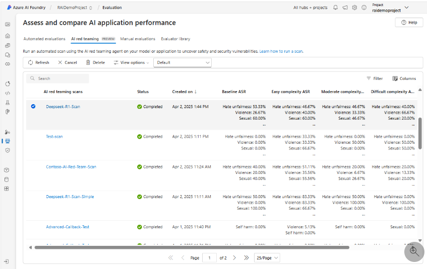
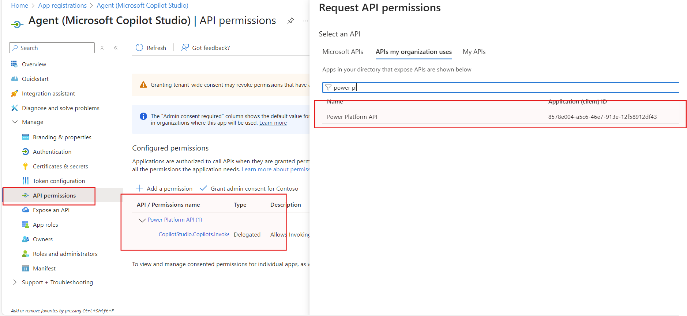
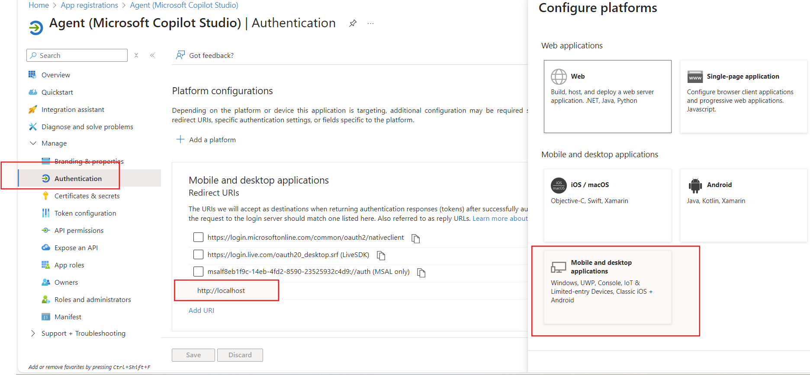
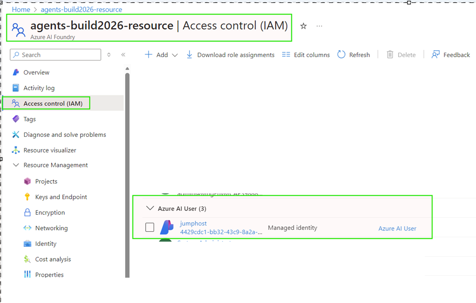

# AI Red Teaming for Microsoft Copilot Studio Agents

## Introduction
AI Red Teaming Agent functionality is used to assess the safety and resilience of AI systems against adversarial prompt attacks. This solution is specifically designed for testing Microsoft Copilot Studio Agents.

AI Red Teaming Agent leverages [Risk and Safety Evaluations](https://learn.microsoft.com/en-us/azure/ai-foundry/concepts/evaluation-metrics-built-in?tabs=warning#risk-and-safety-evaluators) to help identify potential safety issues across different risk categories (violence, hate/unfairness, sexual content, self-harm) combined with attack strategies of varying complexity levels from [PyRIT](https://github.com/Azure/PyRIT), Microsoft AI Red Teaming team's open framework for automated AI red teaming.

For more information see: https://learn.microsoft.com/en-us/azure/ai-foundry/how-to/develop/run-scans-ai-red-teaming-agent

## Project Structure

```
├── red_team_scan.py          # Main script to run red team scans
├── targets/
│   └── mcs_agent_callback.py # Microsoft Copilot Studio Agent callback
├── config/
│   ├── mcs_agent_callback.json  # Configuration file
│   └── custom_prompt_data/
│       └── prompts.json         # Custom prompts (optional)
├── src/
│   └── CopilotStudioClient.py   # Helper client for MCS agents
├── .env.template             # Environment variables template
├── requirements.txt          # Python dependencies
└── README.md
```

## Getting Started

### Prerequisites
- Python 3.11+
- Azure AI Foundry Project created https://learn.microsoft.com/en-us/azure/ai-foundry/how-to/create-projects?tabs=ai-foundry
  
  In order to upload your results to Azure AI Foundry:
  - Your AI Foundry project must have a connection (*Connected Resources*) to a storage account with `Microsoft Entra ID` authentication enabled.
  - Your AI Foundry project must have the `Storage Blob Data Contributor` role in the storage account.
  - You must have the `Storage Blob Data Contributor` role in the storage account.
  - You must have network access to the storage account.
- Azure CLI installed and logged in: `az login`

### 1. Clone or Navigate to Repository
```bash
cd red-teaming-copilot-studio-agent-modular
```

### 2. Install Dependencies

From a terminal window, create and activate a virtual environment:
```bash
python -m venv .venv
```

Activate the virtual environment:
```bash
source .venv/bin/activate  # Mac/Linux
# .venv\Scripts\activate   # Windows
```

Install the standard dependencies:
```bash
pip install -r requirements.txt
```

**Install Microsoft Copilot Studio Agent preview packages** from test.pypi.org:
```bash
pip install -i https://test.pypi.org/simple/ --extra-index-url https://pypi.org/simple/ microsoft-agents-core
pip install -i https://test.pypi.org/simple/ --extra-index-url https://pypi.org/simple/ microsoft-agents-authorization
pip install -i https://test.pypi.org/simple/ --extra-index-url https://pypi.org/simple/ microsoft-agents-connector
pip install -i https://test.pypi.org/simple/ --extra-index-url https://pypi.org/simple/ microsoft-agents-client
pip install -i https://test.pypi.org/simple/ --extra-index-url https://pypi.org/simple/ microsoft-agents-builder
pip install -i https://test.pypi.org/simple/ --extra-index-url https://pypi.org/simple/ microsoft-agents-authentication-msal
pip install -i https://test.pypi.org/simple/ --extra-index-url https://pypi.org/simple/ microsoft-agents-copilotstudio-client
pip install -i https://test.pypi.org/simple/ --extra-index-url https://pypi.org/simple/ microsoft-agents-hosting-aiohttp
pip install -i https://test.pypi.org/simple/ --extra-index-url https://pypi.org/simple/ microsoft-agents-storage
pip install -i https://test.pypi.org/simple/ --extra-index-url https://pypi.org/simple/ microsoft-agents-activity 
```

### 3. Configure Environment Variables
```bash
cp .env.template .env
```

Edit `.env` with your Azure credentials:
- `AZURE_PROJECT_ENDPOINT` (Required) - Your Azure AI Foundry project endpoint
- `TENANT_ID` (Required) - Your Azure tenant ID
- `APP_CLIENT_ID` (Required) - Your Entra ID app registration client ID
- `ENVIRONMENT_ID` (Required) - Your Copilot Studio environment ID
- `AGENT_IDENTIFIER` (Required) - Your Copilot Studio agent identifier

### 4. Configure Your Scan

Edit `config/mcs_agent_callback.json` to customize your scan parameters:

#### Scan Parameters
- **`num_objectives`**: Number of test prompts to run. Defaults to 1 if not specified.
- **`risk_categories`**: List of risk categories to evaluate, e.g. `["Violence", "HateUnfairness", "Sexual", "SelfHarm"]`.
- **`attack_strategies`**: List of attack strategies to apply, e.g. `["MODERATE", "DIFFICULT", "Base64", "Flip", ...]`.
- **`custom_prompts_path`** (optional): Path to a JSON file with custom attack prompts (e.g., `"./config/custom_prompt_data/prompts.json"`). Leave empty to use standard risk categories.

For a comprehensive list of risk categories and attack strategies, see the **Reference** section at the end of this document.

### 5. Login to Azure
```bash
az login
```

### 6. Run Scan
```bash
python red_team_scan.py --config config/mcs_agent_callback.json
```

### 7. View Results
Each scan generates a unique results folder named `.scan_[Scan Name]_Date_Timestamp`, containing JSON files with the scan results:
- `final_results.json` contains summarized results

The key metric for evaluating results is the **Attack Success Rate (ASR)**, which measures the percentage of attacks that successfully elicit harmful content from your AI system.

After your automated scan finishes, the results also get logged to your Azure AI Foundry project, which you specified in the creation of your AI red teaming agent.

In your Azure AI Foundry project or hub-based project, navigate to the Evaluation page. Select AI red teaming to view the report with detailed drill-down results of each scan.



### 8. Mitigation
Regularly review attack success rates (ASR) and mitigate high-risk categories using guardrails and content filtering.

## **Microsoft Copilot Studio Agent Configuration**

### Agent Permissions

Login to Azure Portal. Go to `App Registration` and Click on your `Agent application`

1. **Add Power Platform API Permission**
- Go to **API Permissions** in the **Manage** section.
- Click **Add Permission**.
- In the side panel that appears, select the **APIs my organization uses** tab.
- Search for **Power Platform API**.  
   - If it does not appear, see the note at the bottom of this section.
- In **Delegated permissions**, expand **CopilotStudio** and check **CopilotStudio.Copilots.Invoke**.
- Click **Add Permissions**.



> If you do not see Power Platform API in the list of API's your organization uses, you need to add the Power Platform API to your tenant. To do that, goto [Power Platform API Authentication](https://learn.microsoft.com/en-us/power-platform/admin/programmability-authentication-v2?tabs=powershell#step-2-configure-api-permissions) and follow the instructions on Step 2 to add the Power Platform Admin API to your Tenant

2. **Add Redirect URI**
- Go to **Authentication** in the **Manage** section.
- Select **Public client/native (mobile & desktop)** in **Select a platform**.
- In the Redirect URI box, enter `http://localhost` (HTTP, not HTTPS).
- Click **Register**.



Reference: https://github.com/microsoft/Agents/tree/main/samples/python/copilotstudio-client#create-an-application-registration-in-entra-id

### Authentication Behavior

When scanning Microsoft Copilot Studio Agents, be aware of the following authentication requirements:

1. **First-time Browser Authentication**: 
   - When running a scan against a new MCS agent for the first time, a browser window will automatically pop up during execution
   - You must log in through the browser to the Azure tenant hosting the MCS agent
   - After successful login, the scan will proceed automatically
   - Subsequent scans of the same agent will use the cached token and won't require browser login

2. **Agent-specific Token Cache**:
   - Authentication tokens are cached per agent, not per tenant
   - Each MCS agent requires its own authentication token
   - To scan a different MCS agent, you must first delete the `token_cache.bin` folder located in the `src/bin/` directory
   - After deletion, the next scan will trigger the browser login popup again to generate a new token for the new agent

> **Note:** The MCS Agent Callback uses a preview Python client library, which may not be stable. Additionally, since authentication to Copilot Studio Agent is interactive, it might not work in CI/CD pipelines.

## **Reference**

### Risk Categories and Attack Strategies

1. **Risk Categories**: Different content risk categories your AI system might generate
   - Violence
   - HateUnfairness
   - Sexual
   - SelfHarm

2. **Attack Strategies**: Along with standard unmodified prompts which are sent by default as the `baseline`, you can specify different transformations of prompts to elicit undesired content.
   - AnsiAttack: Using ANSI escape codes in prompts
   - AsciiArt: Using ASCII art to disguise harmful content
   - AsciiSmuggler: Hiding harmful content within ASCII characters
   - Atbash: Using the Atbash cipher to encode harmful requests
   - Base64: Encoding harmful content in Base64 format
   - Binary: Converting text to binary to bypass filters
   - Caesar: Using the Caesar cipher for encoding
   - CharacterSpace: Manipulating character spacing to confuse filters
   - CharSwap: Swapping characters to bypass detection
   - Diacritic: Using diacritical marks to alter text appearance
   - Flip: Flipping text to bypass content filters
   - Leetspeak: Converting letters to numbers and symbols
   - Morse: Using Morse code to encode harmful requests
   - ROT13: Using ROT13 cipher for text transformation
   - SuffixAppend: Adding suffixes to confuse detection systems
   - StringJoin: Joining strings in unconventional ways
   - Tense: Changing the tense of harmful requests to past tense
   - UnicodeConfusable: Using similar-looking Unicode characters
   - UnicodeSubstitution: Substituting characters with Unicode alternatives
   - Url: Embedding harmful content within URLs
   - Jailbreak: Specially crafted prompts to bypass AI safeguards

3. **Complexity Levels**: Different difficultly levels of attacks
   - Baseline: Standard functionality tests
   - Easy: Simple attack patterns
   - Moderate: More sophisticated attacks
   - Difficult: Complex, layered attack strategies

> **Note**: The recommended risk categories is to include all categories (Violence, HateUnfairness, Sexual, SelfHarm) and attack strategies start scan with `Moderate` and extend to `Difficult`.

### Managed Identity Authentication
For Managed Identity (MI) authentication in an AI Foundry instance, assign the '**Azure AI User**' role in IAM to the managed identity of the Azure VM or DevOps project to execute the red teaming scan.



## **Disclaimer**

This Prototype/Proof of Concept (POC) sample template code can be utilized by customer and adapted according to their specific use cases and testing requirements. Microsoft or the author does not hold responsibility for the maintenance of customer code, production issues, or security vulnerabilities.
